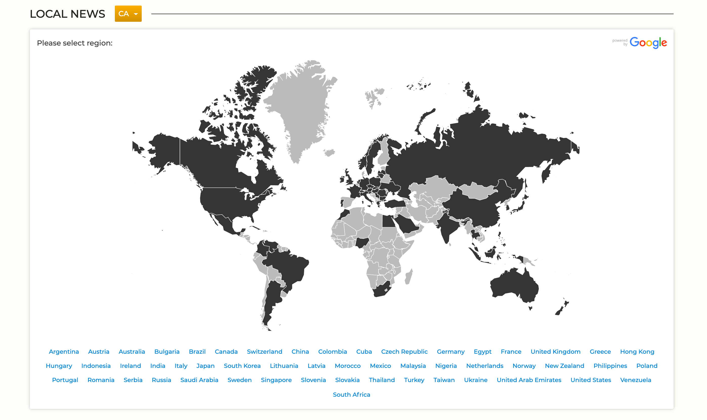
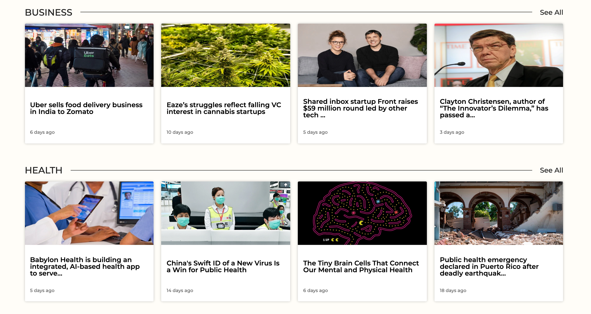
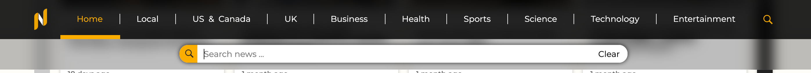
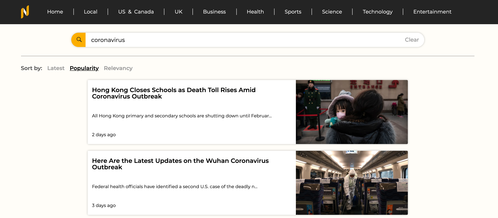
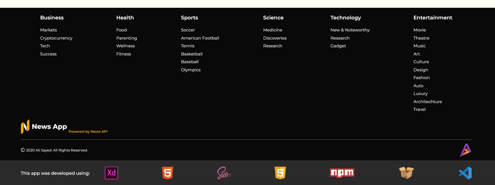
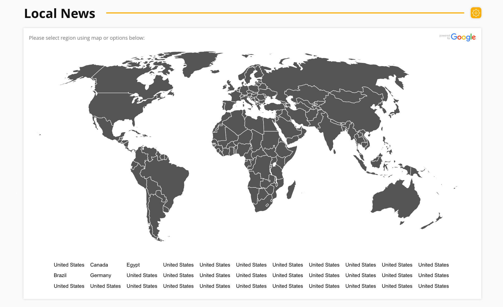
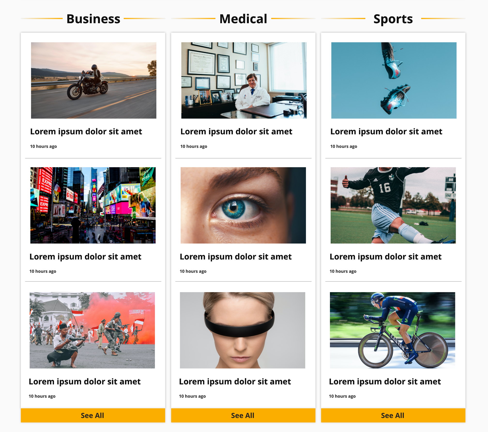
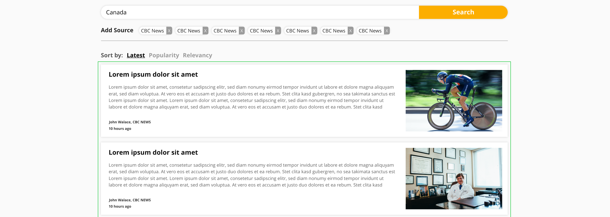
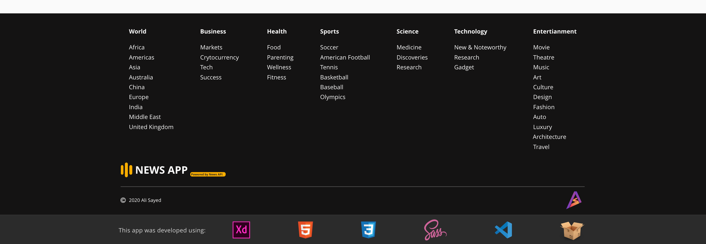

[![homepage][1]][2]

[1]: ./assets/readme-images/full-logo.png
[2]: https://newsapp-as.netlify.com/

Hi! This is a simple news aggregator single-page application deployed on netlify. This is my first web app.

This SPA presents categorized news from 30+ sources and directs user to the original article on the source's website. 

The app makes use of two APIs: [**News API**](https://newsapi.org/) & [**Google GeoChart**](https://developers.google.com/chart/interactive/docs/gallery/geochart). This document should show how the app was roughly created and deployed.

## App Preview

Here is a preview of the app's main sections:


<!-- **Header and top news section on home page:**


**Local news section - map module for selecting region:**



**Category sections on home page:**



**Search bar and search page:**





**Footer:**

 -->

## Pre-Development (UI Design)

Before the app was developed, an initial UI design was created on **Adobe Xd**. The design mainly presented the **structure** of the pages and the **color theme** with some modifications made later. This is my first time using Adobe Xd. Here is a preview of the initial design. 

**Header and top news section on home page:**


**Local news section - map module for selecting region:**



**Category sections on home page:**



**Search page:**



**Footer:**



## APIs

### News API

The news provider API used in this app is [**newsapi.org**](https://newsapi.org/). This API allows two types of requests: top news request & search news request. News can be further filtered by language, country, category and source. Search results can also be sorted by publish date, popularity, or relevancy. 

The results of the API include: the article title, headline, author, published date, source, url, url to image, and content (truncated to 260 characters for free developer users).

Both types of requests were used in the app along with different filters and sorting for different sections. 

### Google GeoChart

This API is provided by google and allows for data visualization in a map view. In this app, the map was used to select desired region for the local news section and page. 

## Page Load & Session Storage

On initial page load, a number of requests are made to the news API to get news for the main sections of the page. These news are then saved in session storage using generated identifier keys. Then, the the results are displayed on the page.

Any request made after that by searching news, changing top news source (default is BBC News), changing local news region (default is Canada) or selecting footer subcategories is saved first to session storage and then displayed on page. The reason behind this is the 500 requests/day limit set by News API. This caching of news allows for less requests to be made to avoid reaching daily limit. 

The current source selected for the top news section and the current region selected for local news is also stored and updated on session storage. 

Checking if news already present in session storage. Fetching and caching news if not:
```javascript
  if (
    !(await JSON.parse(sessionStorage.getItem(`top--${details.topSource}`)))
  ) {
    await addNewsToSessionStorage(
      fetchNews("top", { sources: details.topSource }),
      `top--${details.topSource}`
    );
  }
```

```javascript
export async function addNewsToSessionStorage(news, identifier) {
  const recievedNews = await news;
  const recievedNewsArray = recievedNews.articles;
  sessionStorage.setItem(identifier, JSON.stringify(recievedNewsArray));
}
```

----
**Note**

This app was created for demo purposes only.